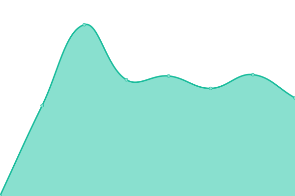
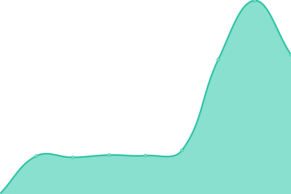

# [📈 Live Status](https://status.sakyey.kr): <!--live status--> **🟩 All systems operational**

This repository contains the open-source uptime monitor and status page for [사계 대광장](https://sakyey.kr), powered by [Upptime](https://github.com/upptime/upptime).

With [Upptime](https://upptime.js.org), you can get your own unlimited and free uptime monitor and status page, powered entirely by a GitHub repository. We use [Issues](https://github.com/sakyey-dev/upptime/issues) as incident reports, [Actions](https://github.com/sakyey-dev/upptime/actions) as uptime monitors, and [Pages](https://status.sakyey.kr) for the status page.

<!--start: status pages-->
<!-- This summary is generated by Upptime (https://github.com/upptime/upptime) -->
<!-- Do not edit this manually, your changes will be overwritten -->
<!-- prettier-ignore -->
| URL | Status | History | Response Time | Uptime |
| --- | ------ | ------- | ------------- | ------ |
|  [Main Page](https://sakyey.kr/about) | 🟩 Up | [main-page.yml](https://github.com/sakyey-dev/upptime/commits/HEAD/history/main-page.yml) | 

 1405ms
     
 | 

<a href="https://status.sakyey.kr/history/main-page">100.00%</a>
    

|  [User Page](https://sakyey.kr/@sakyey) | 🟩 Up | [user-page.yml](https://github.com/sakyey-dev/upptime/commits/HEAD/history/user-page.yml) | 

 273ms
     
 | 

<a href="https://status.sakyey.kr/history/user-page">100.00%</a>
    

|  [Generic API](https://sakyey.kr/api/v1/instance) | 🟩 Up | [generic-api.yml](https://github.com/sakyey-dev/upptime/commits/HEAD/history/generic-api.yml) | 

 174ms
     
 | 

<a href="https://status.sakyey.kr/history/generic-api">100.00%</a>
    

|  [Streaming API](https://sakyey.kr/api/v1/streaming/health) | 🟩 Up | [streaming-api.yml](https://github.com/sakyey-dev/upptime/commits/HEAD/history/streaming-api.yml) | 

 154ms
     
 | 

<a href="https://status.sakyey.kr/history/streaming-api">100.00%</a>
    

|  [ActivityPub](https://sakyey.kr/.well-known/webfinger?resource=acct:sakyey@sakyey.kr) | 🟩 Up | [activity-pub.yml](https://github.com/sakyey-dev/upptime/commits/HEAD/history/activity-pub.yml) | 

 154ms
     
 | 

<a href="https://status.sakyey.kr/history/activity-pub">100.00%</a>
    

<!--end: status pages-->

[**Visit our status website →**](https://status.sakyey.kr)

## 📄 License

- Powered by: [Upptime](https://github.com/upptime/upptime)
- Code: [MIT](./LICENSE) © [Anand Chowdhary](https://anandchowdhary.com), supported by [Pabio](https://pabio.com)
- Data in the `./history` directory: [Open Database License](https://opendatacommons.org/licenses/odbl/1-0/)
- Slightly Modified by: [@stevenoh0908](https://github.com/stevenoh0908)

## Notes for Extension

- Added annoucement display feature on status page. All issues labeled with 'announcement' label will be considered as an announcement.
- You may set a color for each announcement by labeling announcement issues with 'warning' or 'critical' label also. The rules are here as following:
  - Only 'annoucement': Will be considered as 'info'-level announcement. Will be displayed in blue.
  - 'announcement' + 'warning': Will be considered as 'warn'-level announcement. Will be displayed in yellow. Useful for notify maintenance schedules.
  - 'announcement' + 'critical': Will be considered as 'crit'-level annoucement. Will be displayed in red. Useful for notify urgent issues.
- If the announcement issue is closed, then the announcement display will be disappeared automatically. You may add `[expires: YYYY-MM-DD]` into the title of the issue in order to automatically close the announcement at that date.
